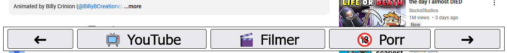

# dad-navigation-bar
A web navigation bar for my dad, so he can browse the web. Injects a static navigation bar on websites.

## Install Instructions
1. Install a web browser addon like GreaseMonkey or Tampermonkey.
2. Using the browser addon, import the *.user.js file in this repo.

## Screenshot

